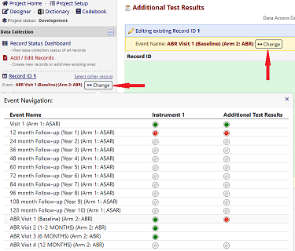
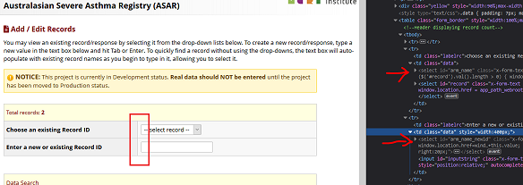
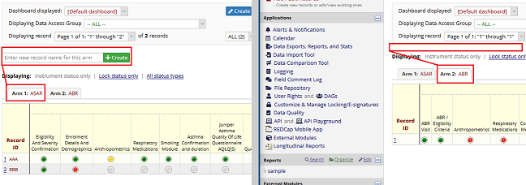

# REDCap External Module: Event Navigation Tweaks

## Description

Provides enhancements to navigation of events and arms on data entry forms, the "Add / Edit Records" page, the "Record Status Dashboard" page, and "Record Home" page.

View [GitHub repository](https://github.com/lsgs/redcap-event-navigation-tweaks).

## Features

Each feature must be enabled separately in the module configuration dialog. 

### 1. Data Entry Form event display
Clicking "Change" by the event name display on a data entry form raises a popover displaying navigation links to the first form and current form (where applicable) in other events.

In a multi-arm project, events are shown only for arms where the record exists (i.e. has data entered for at least one event in the arm).

### 2. Record Home Page Arm Navigation 

In multi-arm projects:
* The "Notice: record X exists on another arm." message is suppressed. 
* Switch to Record Home Page for current record in other arms (where new data can be added, hence record created). 

This option has no effect in single-arm projects.

### 3. Designate First Arm as Primary Arm

Designate the first arm of a multi-arm project as the "primary arm". The Add / Edit Records and Record Status Dashboard pages restrict the creation of new records to the primary arm only (although it will be still possible via import or direct URL access). Records can be added to other arms via the Record Home page.

#### Add / Edit Records Page
Arm-selection dropdown lists are hidden so records can be selected and created in the first arm only.

#### Record Status Dashboard Page
Create record option only shown when viewing the primary arm instead of for any arm.

This option has no effect in single-arm projects.